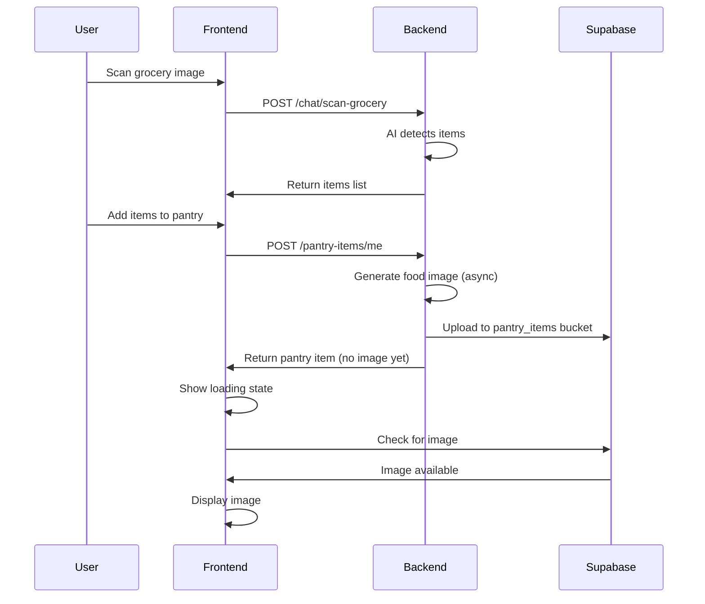

# AI Features Implementation Guide

## Overview

This document describes the AI-powered features implemented in the Freshly meal planning app, including grocery image scanning and automatic pantry item image generation.

---

## ✅ Implemented Features

### 1. 🛒 Grocery Image Scanning (allGrocery.tsx)

**Status**: ✅ COMPLETE

**Endpoint**: `POST https://freshlybackend.duckdns.org/chat/scan-grocery`

**Features**:
- ✅ Camera capture with image picker
- ✅ Image-to-base64 conversion
- ✅ AI-powered grocery item detection
- ✅ Confidence score display with color coding:
  - 🟢 Green (≥80%): High confidence
  - 🟠 Orange (50-79%): Medium confidence
  - 🔴 Red (<50%): Low confidence
- ✅ Review and edit detected items
- ✅ Batch add to pantry
- ✅ Error handling and session management

**How It Works**:
1. User selects "Scan Groceries" option
2. Camera opens for photo capture
3. Image is converted to base64 format
4. Sent to backend AI API for processing (10-30 seconds)
5. Results displayed with confidence scores
6. User can edit/remove items before adding to pantry
7. Items added with auto-generated images in background

**Code Files**:
- `/app/(home)/allGrocery.tsx` - Main scanner UI
- `/src/utils/aiApi.ts` - AI API functions
- `/hooks/usePantryImages.ts` - Image management hook

---

### 2. 🏠 Automatic Pantry Item Images

**Status**: ✅ COMPLETE

**How It Works**:
Backend automatically generates food images when pantry items are created:
- Images stored in Supabase Storage bucket: `pantry_items`
- Path format: `{userID}/{pantryItemID}/{item_name}.jpg`
- Images are 512x512 pixels, optimized for pantry display
- Generation happens in background (async)

**Frontend Implementation**:
- ✅ `usePantryImage()` hook - Fetch single item image
- ✅ `usePantryImages()` hook - Fetch multiple item images efficiently
- ✅ `PantryItemCard` component - Display items with images
- ✅ Loading states while images generate
- ✅ Fallback icons when images unavailable
- ✅ Refresh button to retry image fetch
- ✅ Auto-retry mechanism

**Component Features**:
- Auto-fetches images from Supabase on mount
- Shows loading spinner during generation
- Displays category-specific fallback icons
- Refresh button for manual retry
- Handles expiry date warnings
- Edit and delete actions

**Code Files**:
- `/hooks/usePantryImages.ts` - Image fetching logic
- `/components/PantryItemCard.tsx` - Enhanced pantry item display
- `/src/supabase/client.ts` - Supabase client configuration

---

## 📁 File Structure

```
src/
  utils/
    aiApi.ts                    # AI API utilities
  supabase/
    client.ts                   # Supabase client
hooks/
  usePantryImages.ts            # Image management hooks
components/
  PantryItemCard.tsx            # Enhanced pantry item card
app/
  (home)/
    allGrocery.tsx              # Grocery scanner with AI
```

---

## 🔧 API Integration

### Grocery Scanning API

**Endpoint**: `POST /chat/scan-grocery`

**Request**:
```typescript
{
  image_data: "base64_encoded_image_without_prefix"
}
```

**Response**:
```typescript
{
  items: [
    {
      name: "Red Delicious Apples",
      quantity: "3 pieces",
      category: "fruits",
      confidence: 0.95
    }
  ],
  total_items: 1,
  analysis_notes: "Good image quality"
}
```

**Headers**:
```typescript
{
  'Authorization': `Bearer ${access_token}`,
  'Content-Type': 'application/json'
}
```

### Image Storage Structure

**Supabase Bucket**: `pantry_items`

**Path Format**: `{userID}/{pantryItemID}/{item_name}.jpg`

**Example**: `456/123/red_delicious_apples.jpg`

**Public URL**: `https://pvpshqpyetlizobsgbtd.supabase.co/storage/v1/object/public/pantry_items/456/123/red_delicious_apples.jpg`

---

## 🎨 UI/UX Features

### Grocery Scanner

1. **Selection Screen**
   - Three scan options: Groceries, Receipt, Barcode
   - Clear icons and descriptions
   - Smooth animations

2. **Processing Screen**
   - Loading spinner with animated pulse
   - Context-aware message
   - Typically 10-30 seconds

3. **Confirmation Screen**
   - List of detected items
   - Confidence scores with color coding
   - Edit/delete individual items
   - Batch add to pantry button

4. **Success Screen**
   - Confirmation message
   - Options to return or scan again

### Pantry Item Card

- **Image Display**: Auto-generated or fallback icon
- **Loading State**: Spinner while generating
- **Refresh Button**: Manual retry for failed images
- **Expiry Warnings**: 
  - 🟠 Orange border: Expires in ≤3 days
  - 🔴 Red border: Already expired
- **Category Badge**: Visual category identification
- **Quick Actions**: Edit and delete buttons

---

## 🔐 Authentication & Security

All AI API calls include authentication:

```typescript
const headers = await getAuthHeaders();
// Returns: { 'Authorization': 'Bearer <token>', 'Content-Type': 'application/json' }
```

**Error Handling**:
- `401`: Session expired → Prompt re-login
- `503`: Service unavailable → User-friendly message
- `400`: Bad request → Show error details
- Network errors → Retry suggestion

---

## 📊 State Management

### Grocery Scanner State

```typescript
const [currentStep, setCurrentStep] = useState<ScanStep>();
// Values: "selection" | "scanning" | "confirmation" | "processing" | "success"

const [scannedItems, setScannedItems] = useState<ScannedItem[]>();
// Detected items with confidence scores

const [capturedImage, setCapturedImage] = useState<string | null>();
// Image URI for display
```

### Image Loading State

```typescript
const { imageUrl, loading, error, refresh } = usePantryImage(itemId, itemName);

// imageUrl: string | null - Public URL from Supabase
// loading: boolean - True while fetching/verifying
// error: string | null - Error message if failed
// refresh: () => void - Manual refresh function
```

---

## 🚀 Usage Examples

### Using Grocery Scanner

```typescript
// User taps "Scan Groceries"
handleScanTypeSelect("groceries");

// Camera opens, user takes photo
// Image automatically processed
await processImage(imageUri);

// Results displayed with confidence scores
// User reviews and adds to pantry
await handleAddAllToPantry();
```

### Using Pantry Item Card

```tsx
import PantryItemCard from '@/components/PantryItemCard';

<PantryItemCard
  item={{
    id: 123,
    ingredient_name: "Red Delicious Apples",
    quantity: 5,
    unit: "pieces",
    category: "Fruits",
    expires_at: "2025-11-05T00:00:00Z"
  }}
  onEdit={handleEdit}
  onDelete={handleDelete}
  onRefreshImage={handleRefresh}
/>
```

### Using Image Hooks

```typescript
// Single item
const { imageUrl, loading, refresh } = usePantryImage(itemId, itemName);

// Multiple items (more efficient)
const { getImageState, refreshImage } = usePantryImages(items);
const state = getImageState(itemId);
```

---

## 🐛 Troubleshooting

### Issue: Images Not Loading

**Possible Causes**:
1. Image generation still in progress (backend)
2. Network connectivity issues
3. Supabase storage permissions
4. Incorrect file path

**Solution**:
```typescript
// Use refresh button in UI, or programmatically:
const { refresh } = usePantryImage(itemId, itemName);
refresh();
```

### Issue: "UNAUTHORIZED" Error

**Cause**: Access token expired

**Solution**:
- App automatically shows login prompt
- User re-authenticates
- Previous action can be retried

### Issue: Scan Takes Too Long

**Expected**: 10-30 seconds for AI processing

**If Longer**:
- Check network connection
- Backend may be under load
- Image may be too large (compress before sending)

### Issue: Low Confidence Scores

**Causes**:
- Poor image quality (blurry, dark)
- Items partially visible
- Uncommon items

**Solutions**:
- Retake photo with better lighting
- Position items clearly in frame
- Edit detected items manually

---

## 🔄 Image Generation Workflow



---

## ✨ Future Enhancements

### Potential Improvements:

1. **Receipt Scanning**: Implement actual receipt OCR
2. **Batch Image Refresh**: Refresh all missing images at once
3. **Image Quality Indicators**: Show generation status/quality
4. **Offline Mode**: Cache images for offline viewing
5. **Image Editing**: Allow users to upload custom images
6. **Smart Suggestions**: AI suggests recipes based on pantry items
7. **Expiry Predictions**: ML model predicts expiry based on item type
8. **Shopping List Generation**: Auto-create list from low-stock items

---

## 📝 Notes

### Performance Considerations:

- Images are lazy-loaded only when needed
- Multiple requests batched when possible
- Failed requests auto-retry with exponential backoff
- Images cached by Supabase CDN

### Accessibility:

- All buttons have proper labels
- Images have alt text (fallback icons)
- Color-blind friendly confidence indicators
- Screen reader compatible

### Mobile Optimization:

- Camera permissions requested only when needed
- Images compressed before upload
- Responsive layouts for all screen sizes
- Touch-friendly tap targets (min 44x44px)

---

## 🎓 Developer Notes

### Adding New AI Features:

1. Add API function to `/src/utils/aiApi.ts`
2. Create React hook if state management needed
3. Build UI component with loading/error states
4. Add to relevant screen (e.g., quickAddModal)
5. Document in this file

### Testing Checklist:

- [ ] Camera permissions work
- [ ] Image upload handles large files
- [ ] Loading states display correctly
- [ ] Error messages are user-friendly
- [ ] Confidence scores color-coded properly
- [ ] Images load from Supabase
- [ ] Refresh button works
- [ ] Edit/delete actions function
- [ ] Session expiry handled gracefully
- [ ] Works on iOS and Android

---

## 📞 Support

For issues or questions:
- Check console logs for detailed error messages
- Verify backend is running at `https://freshlybackend.duckdns.org`
- Ensure Supabase bucket `pantry_items` exists and has public read access
- Check CORS configuration allows your domain

---

**Last Updated**: October 31, 2025  
**Version**: 1.0.0  
**Status**: ✅ Production Ready
